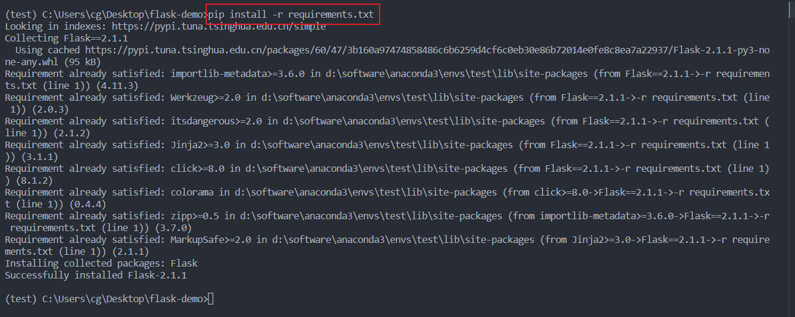
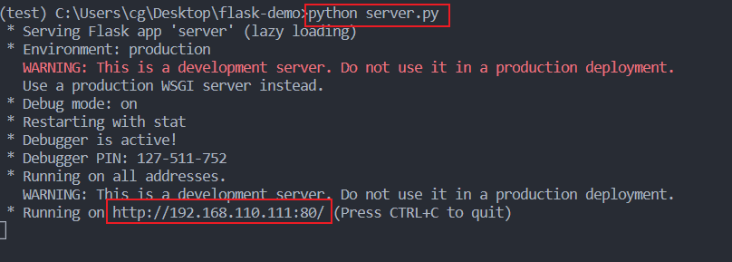
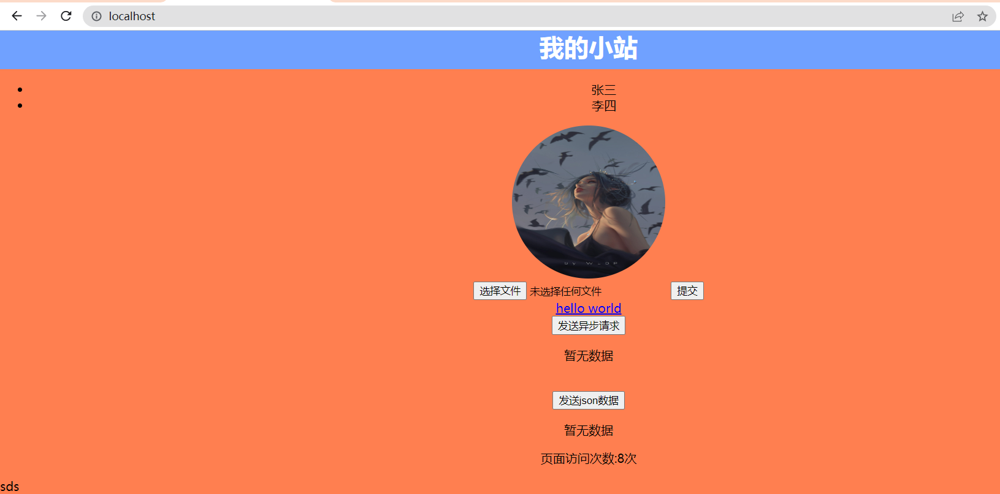

# 简单动态网站开发演示demo

综合使用html,css,javascript对网站功能界面进行改进，同时学习使用python的Flask Web框架进行网站开发。

## 开发工具

* VS Code
* Git
* Python 3.8
  
## 使用方式

1. 安装Flask依赖  

   `pip install -r requirements.txt`  

   

2. 运行项目  

   `python server.py`  

   

3. 打开浏览器
   在浏览器地址栏中输入上图运行中提示的网址即可访问网页。

   

4. 修改static文件夹中的js和css文件，尝试学到的新语法，刷新浏览器查看修改效果。

5. 修改templates文件夹中的html文件,制作新的网页充实站点内容。

6. 修改server.py学习编写后端接口和了解模板渲染等相关后端开发知识。

## 下一步工作

1. 连接MySql数据库，实现对数据的增删改查。
